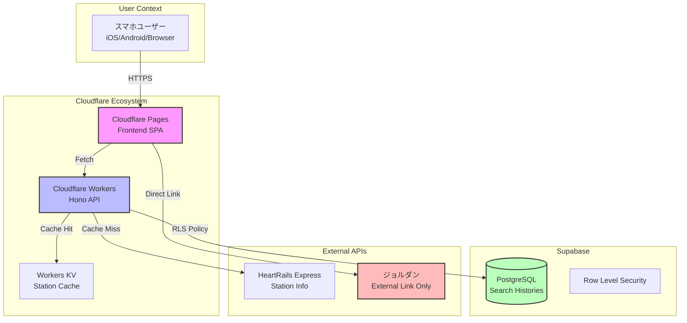
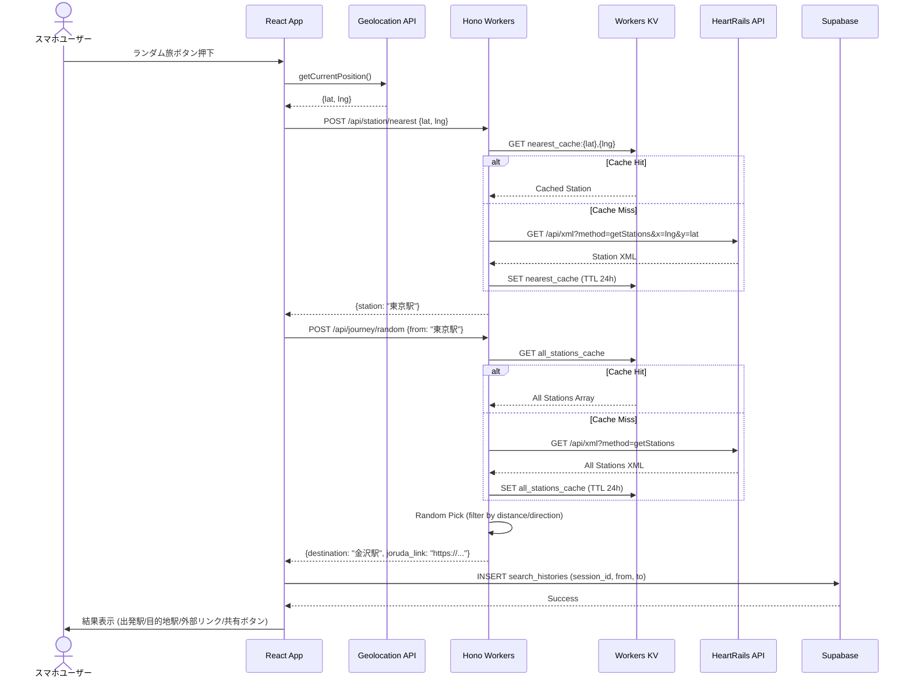
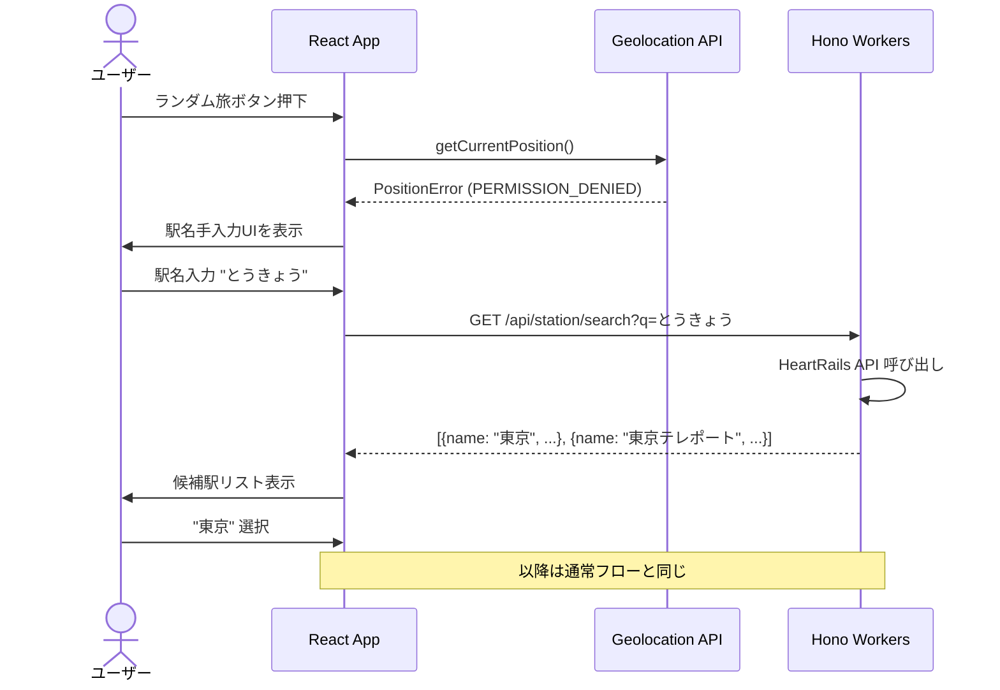
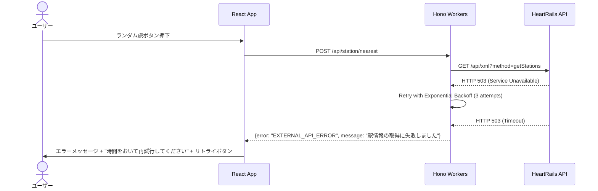
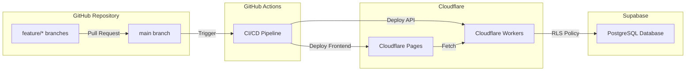

# Design Document: random-journey-generator

**作成日**: 2025-11-11
**ステータス**: 設計生成完了 (承認待ち)
**言語**: 日本語
**フェーズ**: Design Phase

---

## 1. Overview and Goals

### 1.1 システム概要

青春18切符ランダム旅行ジェネレーターは、スマートフォンユーザーがワンタップで現在地から青春18切符対応経路でアクセス可能なランダムな目的地駅への提案を受け取るウェブアプリケーションである。本システムは、**決断疲れ (Decision Fatigue)** を排除し、即興的な冒険体験を提供することを目的とする。

### 1.2 設計目標

| 目標 | 実現手段 | 検証指標 |
|-----|---------|---------|
| **シンプルさ優先** | ワンタップ操作、最小限のUI | タップ数 ≤ 3 回で結果到達 |
| **高速レスポンス** | エッジコンピューティング、積極的キャッシュ | LCP < 2.5s (4G環境) |
| **無料枠運用** | Cloudflare + Supabase 無料枠内 | 月間コスト = $0 |
| **堅牢性** | 外部API障害時のフォールバック | 旅生成成功率 > 90% |
| **プライバシー保護** | 位置情報の非永続化、匿名性担保 | 個人情報保存 = 0 件 |

### 1.3 技術的優先順位

1. **Type Safety**: TypeScript strict mode 全体で有効、Zod による実行時バリデーション
2. **Edge-First**: Cloudflare Workers によるグローバルエッジ配信
3. **Progressive Enhancement**: 位置情報API失敗時の手動入力フォールバック
4. **Cache-Heavy**: Workers KV による外部API負荷削減

---

## 2. Architecture Pattern & Boundary Map

### 2.1 システム境界定義



### 2.2 アーキテクチャパターン

**採用パターン**: **Edge-First Full Stack + API Gateway Pattern**

- **Frontend**: React 18 SPA (Cloudflare Pages CDN配信)
- **API Gateway**: Hono on Cloudflare Workers (エッジコンピューティング)
- **Database**: Supabase PostgreSQL (RLS による匿名ユーザー対応)
- **Cache Layer**: Workers KV (駅情報24時間キャッシュ)

**パターン選択理由**:
- Cloudflare Edgeネットワークによるグローバル低レイテンシ
- Workers自動スケーリングによる可用性確保
- Pages無制限帯域幅による無料枠運用
- KVキャッシュによるSupabase帯域幅削減

---

## 3. Technology Stack

| Layer | Technology | Version | Purpose |
|-------|-----------|---------|---------|
| **Frontend Framework** | React | 18.x | UI構築 |
| **Build Tool** | Vite | 5.x | 高速開発環境 |
| **Styling** | Tailwind CSS | 3.x | Utility-first CSS |
| **Routing** | React Router | 6.x | SPA ルーティング |
| **Backend Framework** | Hono | 4.x | Cloudflare Workers 最適化 |
| **Runtime** | Cloudflare Workers | - | Serverless Edge Runtime |
| **Database** | Supabase PostgreSQL | - | データ永続化 |
| **Cache** | Cloudflare Workers KV | - | 駅情報キャッシュ |
| **Validation** | Zod | 3.x | スキーマ検証 |
| **Type System** | TypeScript | 5.x | 型安全性 |
| **Markdown Parser** | react-markdown | 9.x | 利用規約・プライバシーポリシー表示 |
| **Icon Library** | lucide-react | 0.x | UIアイコン |
| **External APIs** | HeartRails Express | - | 駅情報取得 |
| **External Link** | ジョルダン | - | 経路検索リンク生成 |
| **Deployment** | Cloudflare Pages/Workers | - | ホスティング |

---

## 4. System Flows

### 4.1 ユーザージャーニー: ハッピーパス (位置情報許可)



### 4.2 エラーハンドリングフロー: 位置情報拒否



### 4.3 外部API障害フロー



---

## 5. Requirements Traceability

| 要件ID | 要件名 | 設計での対応 |
|-------|-------|------------|
| **Req 1** | 位置情報取得と出発駅特定 | `useGeolocation` Hook + `/api/station/nearest` エンドポイント + 手動入力フォールバック |
| **Req 2** | ランダム目的地駅の抽選 | `/api/journey/random` エンドポイント + Workers KV 全駅キャッシュ + フィルタリングロジック |
| **Req 3** | 18きっぷ適合経路リンク提示 | ✅ ジョルダンWeb外部リンク生成 (GETパラメータでJR普通・快速検索条件付与) |
| **Req 4** | SNS共有 | Web Share API + Clipboard API フォールバック + OGP メタタグ |
| **Req 5** | エラー処理とユーザー誘導 | 統一エラーハンドリング + フォールバックUI + リトライボタン |
| **Req 6** | UI/UX とアクセシビリティ | Tailwind CSS + ARIA ラベル + キーボードナビゲーション + レスポンシブデザイン |
| **Req 7** | パフォーマンスと可用性 | Workers KV キャッシュ + タイムアウト設定 + Core Web Vitals 最適化 |
| **Req 8** | セキュリティとプライバシー | 環境変数管理 + HTTPS + RLS + 位置情報非永続化 |
| **Req 9** | 運用とデプロイ | Cloudflare Pages/Workers + GitHub Actions CI/CD + 環境変数管理 |

### 5.1 重要な設計決定: ジョルダンWeb外部リンク方式

**背景**: ジョルダンAPIには18きっぷ対応経路のみを検索するフィルタリング機能がなく、Web版でのみ正確な経路確認が可能。

**決定**: 本システムでは**ジョルダンWeb検索ページへの直接リンク生成方式**を採用し、ユーザーがジョルダンサイト上で経路を確認する設計とする。

**実装方針**:
```typescript
// ジョルダンWeb検索リンク生成ロジック
const generateJorudanLink = (from: string, to: string): string => {
  const now = new Date();
  const params = new URLSearchParams({
    eki1: from,          // 出発駅
    eki2: to,            // 目的地駅
    Dym: String(now.getMonth() + 1),
    Ddd: String(now.getDate()),
    Dhh: String(now.getHours()),
    Dmn: String(now.getMinutes()),
    type: '1',           // 普通列車優先
    S: '検索',
  });
  return `https://www.jorudan.co.jp/norikae/cgi/nori.cgi?${params}`;
};
```

**影響**:
- ✅ **メリット**: 外部API依存なし、無料枠制約なし、ジョルダンWebの正確な経路情報を活用
- ⚠️ **注意点**: システム側では18きっぷ適合経路の事前検証は行わず、ユーザーがジョルダン上で確認

---

## 6. Components & Interfaces

### 6.1 フロントエンドコンポーネント階層

```
App (React Router)
├── LandingPage (/)
│   ├── AnnouncementBanner (お知らせ表示 - 上部固定)
│   ├── HeroSection
│   │   └── RandomJourneyButton
│   ├── FilterSection (Collapsible)
│   │   ├── DistanceRangeSlider
│   │   ├── DirectionSelector (N/S/E/W)
│   │   └── PrefectureExcludeCheckboxes
│   └── Footer
│       ├── HeartRailsCredit (駅データ提供元表記)
│       ├── NavigationLinks
│       │   ├── Link to /terms (利用規約)
│       │   ├── Link to /privacy (プライバシーポリシー)
│       │   └── Link to /contact (お問い合わせ)
│       └── Copyright
├── ResultPage (/result/:sessionId)
│   ├── JourneyCard
│   │   ├── StationInfo (Departure/Destination)
│   │   ├── JorudanLinkButton
│   │   └── ShareButton
│   ├── RetryButton
│   └── HistoryLink
├── HistoryPage (/history)
│   └── HistoryList (Supabase RLS)
├── TermsPage (/terms)
│   ├── PageHeader (利用規約)
│   ├── TermsContent (Markdown形式)
│   └── BackToHomeButton
├── PrivacyPage (/privacy)
│   ├── PageHeader (プライバシーポリシー)
│   ├── PrivacyContent (Markdown形式)
│   └── BackToHomeButton
├── ContactPage (/contact)
│   ├── PageHeader (お問い合わせ)
│   ├── GoogleFormEmbed (iframe埋め込み)
│   └── ContactInfo
├── AnnouncementManagement (/admin/announcements) **管理者専用**
│   ├── AnnouncementList
│   ├── CreateAnnouncementForm
│   └── EditAnnouncementModal
└── ErrorPage (/error)
    ├── ErrorMessage
    └── BackToHomeButton
```

### 6.2 TypeScript 型定義

```typescript
// ========================================
// Domain Types (共通ドメインモデル)
// ========================================

/**
 * 駅情報 (HeartRails API レスポンス)
 */
interface Station {
  name: string;         // 駅名 (例: "東京")
  prefecture: string;   // 都道府県 (例: "東京都")
  line: string;         // 路線名 (例: "JR山手線")
  x: number;            // 経度 (例: 139.7671)
  y: number;            // 緯度 (例: 35.6812)
}

/**
 * ランダム旅提案結果
 */
interface Journey {
  sessionId: string;          // セッションID (UUID)
  departureStation: Station;  // 出発駅
  destinationStation: Station; // 目的地駅
  jorudanLink: string;        // ジョルダン外部リンク
  createdAt: Date;            // 生成日時
}

/**
 * 抽選フィルター条件
 */
interface JourneyFilter {
  distanceRange?: {           // 距離レンジ (km)
    min: number;
    max: number;
  };
  direction?: 'north' | 'south' | 'east' | 'west'; // 方角
  excludePrefectures?: string[]; // 除外都道府県リスト
}

/**
 * 位置情報座標
 */
interface GeoCoordinates {
  latitude: number;  // 緯度
  longitude: number; // 経度
}

/**
 * お知らせ情報
 */
interface Announcement {
  id: string;              // UUID
  title: string;           // お知らせタイトル
  content: string;         // お知らせ本文 (Markdown対応)
  type: 'info' | 'warning' | 'maintenance'; // 種類
  isActive: boolean;       // 表示中フラグ
  startDate: Date;         // 表示開始日時
  endDate?: Date;          // 表示終了日時 (オプション)
  createdAt: Date;         // 作成日時
  updatedAt: Date;         // 更新日時
}

// ========================================
// API Request/Response Types
// ========================================

/**
 * POST /api/station/nearest
 */
namespace StationNearestAPI {
  export interface Request {
    latitude: number;
    longitude: number;
  }

  export interface Response {
    station: Station;
  }

  export interface Error {
    error: 'EXTERNAL_API_ERROR' | 'INVALID_COORDINATES';
    message: string;
  }
}

/**
 * GET /api/station/search
 */
namespace StationSearchAPI {
  export interface Request {
    q: string; // 検索クエリ (駅名)
  }

  export interface Response {
    stations: Station[];
  }

  export interface Error {
    error: 'NO_RESULTS' | 'EXTERNAL_API_ERROR';
    message: string;
  }
}

/**
 * POST /api/journey/random
 */
namespace JourneyRandomAPI {
  export interface Request {
    from: string;           // 出発駅名
    filter?: JourneyFilter; // 抽選フィルター
  }

  export interface Response {
    journey: Journey;
  }

  export interface Error {
    error: 'NO_SUITABLE_DESTINATION' | 'EXTERNAL_API_ERROR' | 'RETRY_LIMIT_EXCEEDED';
    message: string;
    suggestion?: string; // エラー時の提案 (例: "距離レンジを拡大してください")
  }
}

/**
 * GET /api/announcements
 */
namespace AnnouncementAPI {
  export interface Response {
    announcements: Announcement[];
  }

  export interface Error {
    error: 'DATABASE_ERROR';
    message: string;
  }
}


// ========================================
// Database Schema Types (Supabase)
// ========================================

/**
 * search_histories テーブル
 */
interface SearchHistory {
  id: string;                  // UUID (Primary Key)
  session_id: string;          // セッションID (RLS ポリシーで使用)
  departure_station: string;   // 出発駅名
  destination_station: string; // 目的地駅名
  jorudan_link: string;        // ジョルダンリンク
  created_at: Date;            // 作成日時 (デフォルト: now())
}

/**
 * announcements テーブル
 */
interface AnnouncementRecord {
  id: string;                  // UUID (Primary Key)
  title: string;               // お知らせタイトル
  content: string;             // お知らせ本文 (Markdown)
  type: 'info' | 'warning' | 'maintenance'; // 種類
  is_active: boolean;          // 表示中フラグ
  start_date: Date;            // 表示開始日時
  end_date?: Date;             // 表示終了日時 (NULL可)
  created_at: Date;            // 作成日時
  updated_at: Date;            // 更新日時
}

// ========================================
// React Hook Types
// ========================================

/**
 * useGeolocation Hook の戻り値
 */
interface UseGeolocationReturn {
  position: GeoCoordinates | null;
  error: GeolocationPositionError | null;
  isLoading: boolean;
}

/**
 * useJourneyGeneration Hook の戻り値
 */
interface UseJourneyGenerationReturn {
  journey: Journey | null;
  isLoading: boolean;
  error: string | null;
  generateJourney: (from: string, filter?: JourneyFilter) => Promise<void>;
  retry: () => Promise<void>;
}

// ========================================
// Validation Schemas (Zod)
// ========================================

import { z } from 'zod';

/**
 * 駅情報スキーマ
 */
const StationSchema = z.object({
  name: z.string().min(1, '駅名は必須です'),
  prefecture: z.string().min(1, '都道府県は必須です'),
  line: z.string().min(1, '路線名は必須です'),
  x: z.number().min(-180).max(180),
  y: z.number().min(-90).max(90),
});

/**
 * 座標スキーマ
 */
const GeoCoordinatesSchema = z.object({
  latitude: z.number().min(-90).max(90),
  longitude: z.number().min(-180).max(180),
});

/**
 * フィルタースキーマ
 */
const JourneyFilterSchema = z.object({
  distanceRange: z.object({
    min: z.number().min(0),
    max: z.number().min(0),
  }).optional(),
  direction: z.enum(['north', 'south', 'east', 'west']).optional(),
  excludePrefectures: z.array(z.string()).optional(),
});

/**
 * API リクエストバリデーション
 */
const StationNearestRequestSchema = z.object({
  latitude: z.number().min(-90).max(90),
  longitude: z.number().min(-180).max(180),
});

const JourneyRandomRequestSchema = z.object({
  from: z.string().min(1, '出発駅は必須です'),
  filter: JourneyFilterSchema.optional(),
});


/**
 * お知らせスキーマ
 */
const AnnouncementSchema = z.object({
  id: z.string().uuid(),
  title: z.string().min(1).max(200),
  content: z.string().min(1).max(5000),
  type: z.enum(['info', 'warning', 'maintenance']),
  is_active: z.boolean(),
  start_date: z.coerce.date(),
  end_date: z.coerce.date().optional(),
  created_at: z.coerce.date(),
  updated_at: z.coerce.date(),
});
```

### 6.3 API エンドポイント仕様

#### 6.3.1 POST `/api/station/nearest`

**目的**: 位置情報から最寄り駅を特定

**リクエスト**:
```json
{
  "latitude": 35.6812,
  "longitude": 139.7671
}
```

**レスポンス (成功)**:
```json
{
  "station": {
    "name": "東京",
    "prefecture": "東京都",
    "line": "JR山手線",
    "x": 139.7671,
    "y": 35.6812
  }
}
```

**エラー**:
```json
{
  "error": "EXTERNAL_API_ERROR",
  "message": "駅情報の取得に失敗しました。時間をおいて再試行してください。"
}
```

**実装ロジック**:
1. Zod で座標バリデーション
2. Workers KV で `nearest_cache:{lat},{lng}` をチェック (TTL: 24h)
3. Cache Miss 時、HeartRails API 呼び出し
4. レスポンスをキャッシュに保存
5. Station 型で返却

---

#### 6.3.2 GET `/api/station/search?q={query}`

**目的**: 駅名検索 (手動入力フォールバック)

**リクエスト**: `/api/station/search?q=とうきょう`

**レスポンス (成功)**:
```json
{
  "stations": [
    {
      "name": "東京",
      "prefecture": "東京都",
      "line": "JR山手線",
      "x": 139.7671,
      "y": 35.6812
    },
    {
      "name": "東京テレポート",
      "prefecture": "東京都",
      "line": "りんかい線",
      "x": 139.7833,
      "y": 35.6258
    }
  ]
}
```

**実装ロジック**:
1. クエリパラメータ `q` をデコード
2. HeartRails API `/api/xml?method=getStations&name={q}` 呼び出し
3. XML パース → Station[] 配列で返却

---

#### 6.3.3 POST `/api/journey/random`

**目的**: ランダム目的地駅を抽選し、ジョルダンリンクを生成

**リクエスト**:
```json
{
  "from": "東京",
  "filter": {
    "distanceRange": {
      "min": 100,
      "max": 500
    },
    "direction": "west",
    "excludePrefectures": ["神奈川県"]
  }
}
```

**レスポンス (成功)**:
```json
{
  "journey": {
    "sessionId": "550e8400-e29b-41d4-a716-446655440000",
    "departureStation": {
      "name": "東京",
      "prefecture": "東京都",
      "line": "JR東海道本線",
      "x": 139.7671,
      "y": 35.6812
    },
    "destinationStation": {
      "name": "金沢",
      "prefecture": "石川県",
      "line": "JR北陸本線",
      "x": 136.6485,
      "y": 36.5781
    },
    "jorudanLink": "https://www.jorudan.co.jp/norikae/cgi/nori.cgi?eki1=東京&eki2=金沢&Dym=11&Ddd=11&Dhh=14&Dmn=30&type=1&S=検索",
    "createdAt": "2025-11-11T14:30:00Z"
  }
}
```

**実装ロジック**:
1. Zod でリクエストバリデーション
2. **レート制限チェック** (Workers KV: IP別 10回/日)
3. Workers KV で `all_stations_cache` 取得 (TTL: 24h)
4. Cache Miss 時、HeartRails API で全駅一覧取得
5. フィルター適用 (距離計算: Haversine公式、方角判定、都道府県除外、**海上座標スナップ**)
6. フィルタリング後の駅からランダム選択 (Math.random())
7. ジョルダンリンク生成
8. セッションID生成 (UUID v4)
9. Journey 型で返却

**距離計算 (Haversine 公式)**:
```typescript
const haversineDistance = (lat1: number, lon1: number, lat2: number, lon2: number): number => {
  const R = 6371; // 地球の半径 (km)
  const dLat = (lat2 - lat1) * Math.PI / 180;
  const dLon = (lon2 - lon1) * Math.PI / 180;
  const a =
    Math.sin(dLat / 2) * Math.sin(dLat / 2) +
    Math.cos(lat1 * Math.PI / 180) * Math.cos(lat2 * Math.PI / 180) *
    Math.sin(dLon / 2) * Math.sin(dLon / 2);
  const c = 2 * Math.atan2(Math.sqrt(a), Math.sqrt(1 - a));
  return R * c;
};
```

**海上座標スナップロジック**:
```typescript
// 抽選された駅候補が海上座標の場合、最寄りの陸地駅にスナップする
const snapToLandStation = (candidate: Station, allStations: Station[]): Station => {
  // 簡易判定: 駅名が存在し、都道府県が設定されていれば陸地と判定
  if (candidate.name && candidate.prefecture) {
    return candidate;
  }

  // 海上座標の場合、最寄りの陸地駅を検索
  const landStations = allStations.filter(s => s.name && s.prefecture);
  if (landStations.length === 0) {
    throw new Error('No land stations available');
  }

  // 最寄りの陸地駅を距離計算で特定
  let nearestStation = landStations[0];
  let minDistance = haversineDistance(
    candidate.y, candidate.x,
    nearestStation.y, nearestStation.x
  );

  for (const station of landStations.slice(1)) {
    const distance = haversineDistance(
      candidate.y, candidate.x,
      station.y, station.x
    );
    if (distance < minDistance) {
      minDistance = distance;
      nearestStation = station;
    }
  }

  return nearestStation;
};
```

**レート制限実装** (Workers KV):
```typescript
// POST /api/journey/random のレート制限
const checkRateLimit = async (env: Env, clientIP: string): Promise<boolean> => {
  const RATE_LIMIT_KEY = `journey_rate_limit:${clientIP}`;
  const currentCount = await env.JOURNEY_RATE_LIMIT.get(RATE_LIMIT_KEY);

  if (currentCount && parseInt(currentCount) >= 10) {
    return false; // レート制限超過
  }

  await env.JOURNEY_RATE_LIMIT.put(
    RATE_LIMIT_KEY,
    String((parseInt(currentCount || '0') + 1)),
    { expirationTtl: 86400 } // 24時間
  );

  return true; // 制限内
};

// エンドポイント内での利用例
if (!await checkRateLimit(c.env, c.req.header('CF-Connecting-IP') || '')) {
  return c.json({
    error: 'RATE_LIMIT_EXCEEDED',
    message: '抽選回数の上限に達しました。明日再度お試しください。'
  }, 429);
}
```

---

#### 6.3.4 GET `/api/announcements`

**目的**: 現在有効なお知らせ一覧を取得

**リクエスト**: `/api/announcements`

**レスポンス (成功)**:
```json
{
  "announcements": [
    {
      "id": "550e8400-e29b-41d4-a716-446655440000",
      "title": "メンテナンス実施のお知らせ",
      "content": "2025年11月15日 2:00-4:00にメンテナンスを実施します。",
      "type": "maintenance",
      "isActive": true,
      "startDate": "2025-11-11T00:00:00Z",
      "endDate": "2025-11-15T12:00:00Z",
      "createdAt": "2025-11-11T00:00:00Z",
      "updatedAt": "2025-11-11T00:00:00Z"
    }
  ]
}
```

**実装ロジック**:
1. Supabase から `announcements` テーブルクエリ
2. `is_active = true` AND `start_date <= NOW()` AND (`end_date IS NULL` OR `end_date > NOW()`) でフィルタリング
3. `start_date DESC` でソート
4. Announcement[] 配列で返却

**Supabaseクエリ例**:
```typescript
const { data, error } = await supabase
  .from('announcements')
  .select('*')
  .eq('is_active', true)
  .lte('start_date', new Date().toISOString())
  .or(`end_date.is.null,end_date.gt.${new Date().toISOString()}`)
  .order('start_date', { ascending: false });
```

---

#### 6.3.5 ContactPage - Googleフォーム埋め込み

**目的**: お問い合わせフォームをGoogleフォームで提供

**実装方針**:
- Googleフォームを作成し、iframe埋め込みコードを取得
- ContactPageコンポーネントでiframe表示
- バックエンドAPI実装は不要 (Googleフォームが直接処理)

**実装例**:
```typescript
// ContactPage.tsx
const ContactPage: React.FC = () => {
  return (
    <div className="container mx-auto px-4 py-8">
      <h1 className="text-3xl font-bold mb-6">お問い合わせ</h1>

      <div className="mb-6">
        <p className="text-gray-600">
          ご質問、不具合報告、機能要望などございましたら、
          下記フォームよりお問い合わせください。
        </p>
      </div>

      {/* Googleフォーム埋め込み */}
      <iframe
        src="https://docs.google.com/forms/d/e/YOUR_FORM_ID/viewform?embedded=true"
        width="100%"
        height="800"
        frameBorder="0"
        marginHeight={0}
        marginWidth={0}
        className="border border-gray-200 rounded-lg"
      >
        読み込んでいます…
      </iframe>

      <div className="mt-6">
        <Link to="/" className="text-blue-600 hover:underline">
          ← トップページに戻る
        </Link>
      </div>
    </div>
  );
};
```

**メリット**:
- ✅ プライバシー保護: ユーザー情報をシステムで保存しない
- ✅ 実装コスト削減: バックエンドAPI不要
- ✅ Googleフォームの高機能性: スパム対策、通知、回答管理


---

### 6.4 React Hooks 設計

#### 6.4.1 `useGeolocation` Hook

```typescript
import { useState, useEffect } from 'react';

interface UseGeolocationReturn {
  position: GeoCoordinates | null;
  error: GeolocationPositionError | null;
  isLoading: boolean;
}

const useGeolocation = (): UseGeolocationReturn => {
  const [position, setPosition] = useState<GeoCoordinates | null>(null);
  const [error, setError] = useState<GeolocationPositionError | null>(null);
  const [isLoading, setIsLoading] = useState<boolean>(true);

  useEffect(() => {
    if (!navigator.geolocation) {
      setError({
        code: 2,
        message: '位置情報APIがサポートされていません',
      } as GeolocationPositionError);
      setIsLoading(false);
      return;
    }

    navigator.geolocation.getCurrentPosition(
      (pos) => {
        setPosition({
          latitude: pos.coords.latitude,
          longitude: pos.coords.longitude,
        });
        setIsLoading(false);
      },
      (err) => {
        setError(err);
        setIsLoading(false);
      },
      {
        enableHighAccuracy: true,
        timeout: 10000, // 10秒
        maximumAge: 0,
      }
    );
  }, []);

  return { position, error, isLoading };
};

export default useGeolocation;
```

---

#### 6.4.2 `useJourneyGeneration` Hook

```typescript
import { useState } from 'react';

interface UseJourneyGenerationReturn {
  journey: Journey | null;
  isLoading: boolean;
  error: string | null;
  generateJourney: (from: string, filter?: JourneyFilter) => Promise<void>;
  retry: () => Promise<void>;
}

const useJourneyGeneration = (): UseJourneyGenerationReturn => {
  const [journey, setJourney] = useState<Journey | null>(null);
  const [isLoading, setIsLoading] = useState<boolean>(false);
  const [error, setError] = useState<string | null>(null);
  const [lastRequest, setLastRequest] = useState<{ from: string; filter?: JourneyFilter } | null>(null);

  const generateJourney = async (from: string, filter?: JourneyFilter) => {
    setIsLoading(true);
    setError(null);
    setLastRequest({ from, filter });

    try {
      const response = await fetch('/api/journey/random', {
        method: 'POST',
        headers: { 'Content-Type': 'application/json' },
        body: JSON.stringify({ from, filter }),
      });

      if (!response.ok) {
        const errorData = await response.json();
        throw new Error(errorData.message || '経路生成に失敗しました');
      }

      const data = await response.json();
      setJourney(data.journey);
    } catch (err) {
      setError(err instanceof Error ? err.message : '不明なエラー');
    } finally {
      setIsLoading(false);
    }
  };

  const retry = async () => {
    if (lastRequest) {
      await generateJourney(lastRequest.from, lastRequest.filter);
    }
  };

  return { journey, isLoading, error, generateJourney, retry };
};

export default useJourneyGeneration;
```

---

## 7. Data Models

### 7.1 Supabase PostgreSQL スキーマ

#### 7.1.1 `search_histories` テーブル

```sql
CREATE TABLE search_histories (
  id UUID PRIMARY KEY DEFAULT gen_random_uuid(),
  session_id TEXT NOT NULL,          -- セッションID (localStorage から取得)
  departure_station TEXT NOT NULL,   -- 出発駅名
  destination_station TEXT NOT NULL, -- 目的地駅名
  jorudan_link TEXT NOT NULL,        -- ジョルダンリンク
  created_at TIMESTAMPTZ NOT NULL DEFAULT now()
);

-- RLS ポリシー有効化
ALTER TABLE search_histories ENABLE ROW LEVEL SECURITY;

-- 匿名ユーザー用ポリシー (session_id ベース)
CREATE POLICY "Anonymous users can manage their own histories"
ON search_histories
FOR ALL
USING (session_id = current_setting('request.headers')::json->>'x-session-id')
WITH CHECK (session_id = current_setting('request.headers')::json->>'x-session-id');

-- パフォーマンス最適化: session_id インデックス
CREATE INDEX idx_search_histories_session_id ON search_histories(session_id);

-- 古い履歴の自動削除 (30日後)
CREATE OR REPLACE FUNCTION delete_old_histories()
RETURNS void AS $$
BEGIN
  DELETE FROM search_histories WHERE created_at < NOW() - INTERVAL '30 days';
END;
$$ LANGUAGE plpgsql;

-- Cron Job (Supabase pg_cron 拡張)
SELECT cron.schedule(
  'delete-old-histories',
  '0 2 * * *', -- 毎日午前2時
  'SELECT delete_old_histories();'
);
```

#### 7.1.2 `announcements` テーブル

```sql
CREATE TABLE announcements (
  id UUID PRIMARY KEY DEFAULT gen_random_uuid(),
  title TEXT NOT NULL,
  content TEXT NOT NULL,               -- Markdown対応
  type TEXT NOT NULL CHECK (type IN ('info', 'warning', 'maintenance')),
  is_active BOOLEAN NOT NULL DEFAULT false,
  start_date TIMESTAMPTZ NOT NULL DEFAULT now(),
  end_date TIMESTAMPTZ,                -- NULL: 無期限
  created_at TIMESTAMPTZ NOT NULL DEFAULT now(),
  updated_at TIMESTAMPTZ NOT NULL DEFAULT now()
);

-- RLS ポリシー有効化 (読み取り専用)
ALTER TABLE announcements ENABLE ROW LEVEL SECURITY;

-- 匿名ユーザーは有効なお知らせのみ閲覧可能
CREATE POLICY "Public read access for active announcements"
ON announcements
FOR SELECT
USING (
  is_active = true
  AND start_date <= now()
  AND (end_date IS NULL OR end_date > now())
);

-- パフォーマンス最適化: 複合インデックス
CREATE INDEX idx_announcements_active ON announcements(is_active, start_date DESC)
WHERE is_active = true;

-- 更新日時の自動更新トリガー
CREATE OR REPLACE FUNCTION update_updated_at_column()
RETURNS TRIGGER AS $$
BEGIN
  NEW.updated_at = now();
  RETURN NEW;
END;
$$ LANGUAGE plpgsql;

CREATE TRIGGER update_announcements_updated_at
BEFORE UPDATE ON announcements
FOR EACH ROW
EXECUTE FUNCTION update_updated_at_column();
```

---

#### 7.1.3 セッション管理 (フロントエンド)

```typescript
// utils/session.ts
const getOrCreateSessionId = (): string => {
  const SESSION_KEY = 'seishun18_session_id';
  let sessionId = localStorage.getItem(SESSION_KEY);

  if (!sessionId) {
    sessionId = crypto.randomUUID(); // UUID v4
    localStorage.setItem(SESSION_KEY, sessionId);
  }

  return sessionId;
};

// Supabase クライアント設定
import { createClient } from '@supabase/supabase-js';

const supabase = createClient(
  import.meta.env.VITE_SUPABASE_URL,
  import.meta.env.VITE_SUPABASE_ANON_KEY,
  {
    global: {
      headers: {
        'x-session-id': getOrCreateSessionId(),
      },
    },
  }
);
```

---

### 7.2 Workers KV データ構造

| Key | Value | TTL | Purpose |
|-----|-------|-----|---------|
| `all_stations_cache` | `Station[]` JSON | 24h | 全駅一覧キャッシュ |
| `nearest_cache:{lat},{lng}` | `Station` JSON | 24h | 最寄り駅キャッシュ |
| `journey_rate_limit:{IP}` | Number (抽選回数) | 24h | ランダム旅抽選レート制限 (10回/日) |
| `station_search_rate_limit:{IP}` | Number (検索回数) | 24h | 駅検索レート制限 (20回/日) |

**設定例** (wrangler.toml):
```toml
[[kv_namespaces]]
binding = "STATION_CACHE"
id = "your-station-cache-kv-id"

[[kv_namespaces]]
binding = "JOURNEY_RATE_LIMIT"
id = "your-journey-rate-limit-kv-id"

[[kv_namespaces]]
binding = "STATION_SEARCH_RATE_LIMIT"
id = "your-station-search-rate-limit-kv-id"
```

---

## 8. Error Handling Strategy

### 8.1 エラー分類とハンドリング

| エラーカテゴリ | 発生源 | ユーザー表示 | リトライ戦略 |
|--------------|-------|------------|------------|
| **PERMISSION_DENIED** | Geolocation API | "位置情報が必要です" + 手動入力UI | - |
| **EXTERNAL_API_ERROR** | HeartRails/ジョルダン | "駅情報の取得に失敗しました" + リトライボタン | Exponential Backoff (3回) |
| **NO_SUITABLE_DESTINATION** | ランダム抽選 | "適合経路なし" + 再抽選ボタン | 無制限 (上限10回) |
| **RETRY_LIMIT_EXCEEDED** | 再抽選上限 | "抽選条件を緩和してください" | - |
| **VALIDATION_ERROR** | Zod バリデーション | "入力内容を確認してください" | - |
| **NETWORK_ERROR** | Fetch 失敗 | "ネットワークエラー" + リトライボタン | Exponential Backoff (3回) |

### 8.2 Exponential Backoff 実装

```typescript
// utils/retry.ts
const exponentialBackoff = async <T>(
  fn: () => Promise<T>,
  maxRetries: number = 3
): Promise<T> => {
  let attempt = 0;
  while (attempt < maxRetries) {
    try {
      return await fn();
    } catch (error) {
      attempt++;
      if (attempt >= maxRetries) throw error;

      const delay = Math.pow(2, attempt) * 1000; // 2^n 秒
      console.warn(`Retry ${attempt}/${maxRetries} after ${delay}ms`);
      await new Promise(resolve => setTimeout(resolve, delay));
    }
  }
  throw new Error('Retry limit exceeded');
};

// 使用例
const fetchStation = async (lat: number, lng: number) => {
  return exponentialBackoff(async () => {
    const response = await fetch(`/api/station/nearest`, {
      method: 'POST',
      body: JSON.stringify({ latitude: lat, longitude: lng }),
    });
    if (!response.ok) throw new Error('API Error');
    return response.json();
  });
};
```

---

## 9. Testing Strategy

### 9.1 テスト範囲マトリクス

| Layer | Test Type | Tool | Coverage Target |
|-------|-----------|------|----------------|
| **Frontend** | Unit Test | Vitest + React Testing Library | > 80% (Hooks, Utils) |
| **Frontend** | E2E Test | Playwright | Critical User Journeys (3シナリオ) |
| **API** | Integration Test | Vitest + Miniflare | > 90% (全エンドポイント) |
| **API** | Mock Test | MSW | 外部API障害シミュレーション |

### 9.2 テストシナリオ

#### 9.2.1 E2E テスト (Playwright)

**シナリオ1: ハッピーパス**
```typescript
test('should generate random journey with geolocation', async ({ page, context }) => {
  await context.grantPermissions(['geolocation']);
  await context.setGeolocation({ latitude: 35.6812, longitude: 139.7671 }); // 東京駅

  await page.goto('/');
  await page.click('button:has-text("ランダム旅")');

  await expect(page.locator('text=出発駅')).toBeVisible();
  await expect(page.locator('text=東京')).toBeVisible(); // 最寄り駅
  await expect(page.locator('a:has-text("経路を見る")')).toBeVisible(); // ジョルダンリンク
});
```

**シナリオ2: 位置情報拒否**
```typescript
test('should fallback to manual input when geolocation is denied', async ({ page, context }) => {
  await context.clearPermissions();

  await page.goto('/');
  await page.click('button:has-text("ランダム旅")');

  await expect(page.locator('text=位置情報が必要です')).toBeVisible();
  await expect(page.locator('input[placeholder*="駅名"]')).toBeVisible();

  await page.fill('input[placeholder*="駅名"]', 'とうきょう');
  await page.click('button:has-text("東京")'); // 候補選択
  await expect(page.locator('text=出発駅')).toBeVisible();
});
```

#### 9.2.2 API Integration Test (Miniflare)

```typescript
import { unstable_dev } from 'wrangler';

describe('POST /api/station/nearest', () => {
  let worker: UnstableDevWorker;

  beforeAll(async () => {
    worker = await unstable_dev('api/src/index.ts', {
      experimental: { disableExperimentalWarning: true },
    });
  });

  afterAll(async () => {
    await worker.stop();
  });

  it('should return nearest station', async () => {
    const response = await worker.fetch('/api/station/nearest', {
      method: 'POST',
      headers: { 'Content-Type': 'application/json' },
      body: JSON.stringify({ latitude: 35.6812, longitude: 139.7671 }),
    });

    expect(response.status).toBe(200);
    const data = await response.json();
    expect(data.station.name).toBe('東京');
  });
});
```

---

## 10. Security Considerations

### 10.1 セキュリティチェックリスト

| 項目 | 実装内容 | 検証方法 |
|-----|---------|---------|
| **API キー管理** | 環境変数 (wrangler.toml, .env) | `git secrets` スキャン |
| **HTTPS 通信** | Cloudflare Pages 自動HTTPS | ブラウザ開発者ツール確認 |
| **CORS 設定** | Hono CORS ミドルウェア | Preflight Request テスト |
| **RLS ポリシー** | Supabase RLS 有効化 | Supabase Dashboard 確認 |
| **XSS 対策** | React 自動エスケープ | OWASP ZAP スキャン |
| **位置情報非永続化** | localStorage 使用禁止 | コードレビュー |
| **共有URL匿名化** | セッションID のみ含む | URL パラメータ検証 |

### 10.2 環境変数管理

**wrangler.toml** (Cloudflare Workers):
```toml
[vars]
FRONTEND_ORIGIN = "https://seishun18-random-journey.pages.dev"
SUPABASE_URL = "https://your-project.supabase.co"
SUPABASE_ANON_KEY = "eyJhbGciOiJIUzI1NiIsInR5cCI6IkpXVCJ9..."

[[kv_namespaces]]
binding = "STATION_CACHE"
id = "your-station-cache-kv-id"

```

**frontend/.env.example**:
```env
VITE_API_BASE_URL=https://api.workers.dev
VITE_SUPABASE_URL=https://your-project.supabase.co
VITE_SUPABASE_ANON_KEY=eyJhbGciOiJIUzI1NiIsInR5cCI6IkpXVCJ9...
```

---

## 11. Performance Optimization

### 11.1 Core Web Vitals 最適化戦略

| 指標 | 目標値 | 実装手段 |
|-----|-------|---------|
| **LCP** | < 2.5s | Vite Code Splitting, Cloudflare Pages CDN, WebP 画像 |
| **FID** | < 100ms | React 18 Concurrent Rendering, debounce 入力 |
| **CLS** | < 0.1 | 固定高さコンテナ, `aspect-ratio` CSS |

### 11.2 キャッシュ戦略

```typescript
// api/src/cache.ts
import type { KVNamespace } from '@cloudflare/workers-types';

const CACHE_TTL = 60 * 60 * 24; // 24時間

export const getCachedStations = async (kv: KVNamespace): Promise<Station[] | null> => {
  const cached = await kv.get('all_stations_cache', 'json');
  return cached as Station[] | null;
};

export const setCachedStations = async (kv: KVNamespace, stations: Station[]): Promise<void> => {
  await kv.put('all_stations_cache', JSON.stringify(stations), {
    expirationTtl: CACHE_TTL,
  });
};
```

### 11.3 バンドルサイズ最適化

- **Tree Shaking**: Vite 自動最適化
- **Code Splitting**: React Router lazy loading
```typescript
const HistoryPage = lazy(() => import('./pages/HistoryPage'));
```
- **依存関係削減**: Tailwind CSS PurgeCSS、未使用ライブラリ削除

---

## 12. Deployment & CI/CD

### 12.1 デプロイ構成



### 12.2 GitHub Actions ワークフロー

```yaml
name: Deploy to Cloudflare

on:
  push:
    branches: [main]

jobs:
  deploy-frontend:
    runs-on: ubuntu-latest
    steps:
      - uses: actions/checkout@v4
      - uses: actions/setup-node@v4
        with:
          node-version: 20
      - run: cd frontend && npm ci
      - run: cd frontend && npm run build
      - uses: cloudflare/pages-action@v1
        with:
          apiToken: ${{ secrets.CLOUDFLARE_API_TOKEN }}
          accountId: ${{ secrets.CLOUDFLARE_ACCOUNT_ID }}
          projectName: seishun18-random-journey
          directory: frontend/dist

  deploy-api:
    runs-on: ubuntu-latest
    steps:
      - uses: actions/checkout@v4
      - uses: actions/setup-node@v4
        with:
          node-version: 20
      - run: cd api && npm ci
      - run: cd api && npx wrangler deploy
        env:
          CLOUDFLARE_API_TOKEN: ${{ secrets.CLOUDFLARE_API_TOKEN }}
```

---

## 13. Monitoring & Observability

### 13.1 監視項目

| 項目 | ツール | アラート条件 |
|-----|-------|-----------|
| **Workers リクエスト数** | Cloudflare Dashboard | > 90K req/日 |
| **Supabase 帯域幅** | Supabase Dashboard | > 9GB/月 |
| **外部API失敗率** | Workers Analytics | > 10% |
| **Core Web Vitals** | Google Search Console | LCP > 3s |
| **エラーレート** | Sentry (将来追加) | > 5% |

### 13.2 ログ収集

```typescript
// api/src/middleware/logger.ts
import { Context, Next } from 'hono';

export const logger = async (c: Context, next: Next) => {
  const start = Date.now();
  await next();
  const end = Date.now();

  console.log(JSON.stringify({
    method: c.req.method,
    path: c.req.path,
    status: c.res.status,
    duration: end - start,
    timestamp: new Date().toISOString(),
  }));
};
```

---

## 14. Legal Pages and Static Content

### 14.1 利用規約 (Terms of Service)

**配置場所**: `/frontend/src/content/terms.md` (Markdown形式)

**主要セクション**:

```markdown
# 利用規約

**最終更新日**: 2025年11月11日

## 1. サービス概要

青春18切符ランダム旅行ジェネレーター（以下「本サービス」）は、ユーザーに対してランダムな旅行先を提案する無料のウェブアプリケーションです。

## 2. 利用条件

- 本サービスは無保証で提供されます
- ユーザーは自己責任で本サービスを利用するものとします
- 提案された経路情報の正確性について、運営者は一切の責任を負いません

## 3. 禁止事項

以下の行為を禁止します:
- 本サービスに過度な負荷をかける行為
- 自動化ツールによる大量アクセス
- 本サービスの運営を妨害する行為

## 4. 免責事項

- 外部API (HeartRails Express、ジョルダン) の障害による情報取得失敗について責任を負いません
- 提案された経路の利用により発生した損害について責任を負いません
- 本サービスは予告なく変更・終了する場合があります

## 5. 知的財産権

本サービスのデザイン、ロゴ、ソースコードの著作権は運営者に帰属します。

## 6. 準拠法・管轄裁判所

本規約は日本法に準拠し、本サービスに関する紛争については東京地方裁判所を専属的合意管轄裁判所とします。

## 7. お問い合わせ

本規約に関するご質問は、[お問い合わせフォーム](/contact) からご連絡ください。
```

---

### 14.2 プライバシーポリシー (Privacy Policy)

**配置場所**: `/frontend/src/content/privacy.md` (Markdown形式)

**主要セクション**:

```markdown
# プライバシーポリシー

**最終更新日**: 2025年11月11日

## 1. 収集する情報

### 1.1 位置情報
- **収集目的**: 最寄り駅の自動特定
- **保存期間**: 一切保存しません (メモリ上で即時破棄)
- **第三者提供**: HeartRails Express API への座標送信のみ

### 1.2 検索履歴
- **収集内容**: 出発駅、目的地駅、経路リンク
- **保存期間**: 30日間 (自動削除)
- **識別方法**: ブラウザセッションID (匿名)
- **第三者提供**: なし

### 1.3 お問い合わせ情報
- **収集内容**: お問い合わせフォーム入力内容
- **管理方法**: Googleフォームで管理
- **プライバシーポリシー**: [Google プライバシーポリシー](https://policies.google.com/privacy)

## 2. 利用目的

収集した情報は以下の目的でのみ利用します:
- サービス提供 (駅検索、経路提案)
- サービス改善・統計分析
- お問い合わせ対応

## 3. 第三者提供

以下の外部サービスにデータを送信します:

### 3.1 HeartRails Express API
- **送信データ**: 位置情報座標、駅名検索クエリ
- **目的**: 駅情報取得
- **プライバシーポリシー**: http://express.heartrails.com/

### 3.2 Google (お問い合わせ機能)
- **送信データ**: Googleフォーム入力内容
- **目的**: お問い合わせ管理
- **プライバシーポリシー**: https://policies.google.com/privacy

## 4. Cookie・ブラウザストレージ

### 4.1 localStorage
- **用途**: セッションID保存 (検索履歴管理)
- **有効期限**: ブラウザキャッシュクリアまで
- **削除方法**: ブラウザ設定から削除可能

### 4.2 Cookie
本サービスは Cookie を使用しません。

## 5. セキュリティ対策

- すべての通信を HTTPS で暗号化
- Supabase Row Level Security (RLS) によるデータアクセス制御
- API キーのサーバーサイド管理

## 6. お子様のプライバシー

本サービスは13歳未満のお子様を対象としていません。

## 7. プライバシーポリシーの変更

本ポリシーは予告なく変更する場合があります。変更後は本ページにて通知します。

## 8. お問い合わせ

プライバシーに関するご質問は、[お問い合わせフォーム](/contact) からご連絡ください。
```

---

### 14.3 クレジット表記 (Footer Component)

**実装場所**: `/frontend/src/components/Footer.tsx`

**必須表記内容**:

```tsx
export const Footer = () => {
  return (
    <footer className="bg-gray-100 py-8 mt-16">
      <div className="container mx-auto px-4">
        {/* HeartRails Express クレジット (必須) */}
        <div className="text-center mb-4 text-sm text-gray-600">
          駅データ提供:{' '}
          <a
            href="http://express.heartrails.com/"
            target="_blank"
            rel="noopener noreferrer"
            className="text-blue-600 hover:underline"
          >
            HeartRails Express
          </a>
        </div>

        {/* ナビゲーションリンク */}
        <nav className="flex justify-center space-x-6 mb-4">
          <Link to="/terms" className="text-gray-600 hover:text-gray-900">
            利用規約
          </Link>
          <Link to="/privacy" className="text-gray-600 hover:text-gray-900">
            プライバシーポリシー
          </Link>
          <Link to="/contact" className="text-gray-600 hover:text-gray-900">
            お問い合わせ
          </Link>
        </nav>

        {/* 著作権表示 */}
        <div className="text-center text-sm text-gray-500">
          © 2025 青春18切符ランダム旅行ジェネレーター. All rights reserved.
        </div>
      </div>
    </footer>
  );
};
```

---

### 14.4 お知らせバナー (Announcement Banner Component)

**実装場所**: `/frontend/src/components/AnnouncementBanner.tsx`

**実装例**:

```tsx
import { useEffect, useState } from 'react';
import { X } from 'lucide-react'; // アイコンライブラリ

interface Announcement {
  id: string;
  title: string;
  content: string;
  type: 'info' | 'warning' | 'maintenance';
}

export const AnnouncementBanner = () => {
  const [announcements, setAnnouncements] = useState<Announcement[]>([]);
  const [dismissed, setDismissed] = useState<Set<string>>(new Set());

  useEffect(() => {
    const fetchAnnouncements = async () => {
      const response = await fetch('/api/announcements');
      const data = await response.json();
      setAnnouncements(data.announcements);

      // localStorage から閉じたお知らせIDを復元
      const dismissedIds = JSON.parse(
        localStorage.getItem('dismissed_announcements') || '[]'
      );
      setDismissed(new Set(dismissedIds));
    };

    fetchAnnouncements();
  }, []);

  const handleDismiss = (id: string) => {
    const newDismissed = new Set(dismissed).add(id);
    setDismissed(newDismissed);
    localStorage.setItem(
      'dismissed_announcements',
      JSON.stringify([...newDismissed])
    );
  };

  const visibleAnnouncements = announcements.filter(
    (a) => !dismissed.has(a.id)
  );

  if (visibleAnnouncements.length === 0) return null;

  const colorMap = {
    info: 'bg-blue-50 border-blue-200 text-blue-900',
    warning: 'bg-yellow-50 border-yellow-200 text-yellow-900',
    maintenance: 'bg-red-50 border-red-200 text-red-900',
  };

  return (
    <div className="fixed top-0 left-0 right-0 z-50">
      {visibleAnnouncements.map((announcement) => (
        <div
          key={announcement.id}
          className={`${colorMap[announcement.type]} border-b px-4 py-3 flex justify-between items-center`}
        >
          <div className="flex-1">
            <p className="font-semibold">{announcement.title}</p>
            <p className="text-sm">{announcement.content}</p>
          </div>
          <button
            onClick={() => handleDismiss(announcement.id)}
            className="ml-4 p-1 hover:bg-white/50 rounded"
            aria-label="閉じる"
          >
            <X size={20} />
          </button>
        </div>
      ))}
    </div>
  );
};
```

---

## 15. Open Issues and Future Work

### 15.1 既知の制約事項

| 課題 | 影響 | 対応方針 |
|-----|-----|---------|
| **ジョルダンAPI統合なし** | 経路の事前検証不可 | Phase 2 で商用API申請検討 |
| **18きっぷ適合率不明** | 再抽選回数増加の可能性 | 統計データ収集後、抽選ロジック最適化 |
| **クロスデバイス履歴非対応** | 匿名ユーザーはブラウザセッション限定 | 将来的に認証機能追加 |

### 15.2 将来的拡張機能

**Phase 2 (3ヶ月後)**:
- ジョルダン商用API統合 (経路の事前検証、所要時間表示)
- ユーザー認証 (Supabase Auth) によるクロスデバイス履歴
- お気に入り駅登録機能

**Phase 3 (6ヶ月後)**:
- AI おすすめスポット提示 (目的地駅周辺の観光情報)
- 旅行プラン保存・共有機能
- PWA 化 (オフライン対応)

---

## 15. Glossary

| 用語 | 定義 |
|-----|-----|
| **青春18切符** | JR 全線普通列車・快速列車乗り放題チケット (期間限定販売) |
| **HeartRails Express API** | 無料駅情報API (クレジット表記必須) |
| **ジョルダン** | 日本の乗換案内サービス (外部リンク提示) |
| **Workers KV** | Cloudflare Workers のグローバルキーバリューストア |
| **RLS (Row Level Security)** | Supabase の行レベルセキュリティポリシー |
| **Haversine 公式** | 球面上の2点間距離を計算する数式 |
| **EARS 形式** | 要求仕様記述形式 (Event-driven Acceptance Requirements Syntax) |

---

## 16. Approval and Sign-off

**設計者**: Claude (Kiro Framework)
**作成日**: 2025-11-11
**ステータス**: ✅ 設計生成完了 (承認待ち)

**次のアクション**:
1. ユーザーによる設計レビュー
2. 設計承認 → `spec.json` の `approvals.design.approved: true` 更新
3. `/kiro:spec-tasks random-journey-generator -y` でタスク分解
4. `/kiro:spec-impl random-journey-generator [tasks]` で実装開始

---

**変更履歴**:
- 2025-11-11: 初版作成
